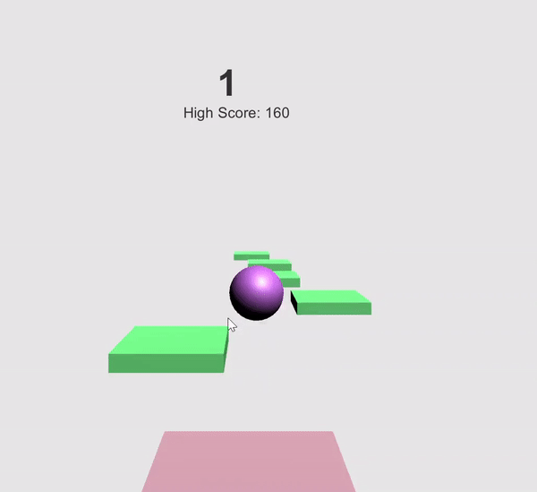

# Hop  
This is **imitation version of mobile game hop** which player must continuously move the ball to a moving platform.  
This is my **first attempt to create and publish a game on public using Unity**.  
Hop can be played on a website as a flash game or as an application on a desktop.  

## Technology  
Language Used: **C#**  
Development Tool: **Unity**

## Instructions 
Game on a website (flash version) - click on the link [https://jieung.itch.io/bounce](https://jieung.itch.io/bounce)  
Game on a desktop (Application) - downlaod [Hop.zip](Hop.zip) and unzip it to launch an executable file named **Hop**  
How to Play:
- Use the mouse cursor to move the ball.  
- Move the cursor around to hit the ball on a moving platform.  

## Demo

